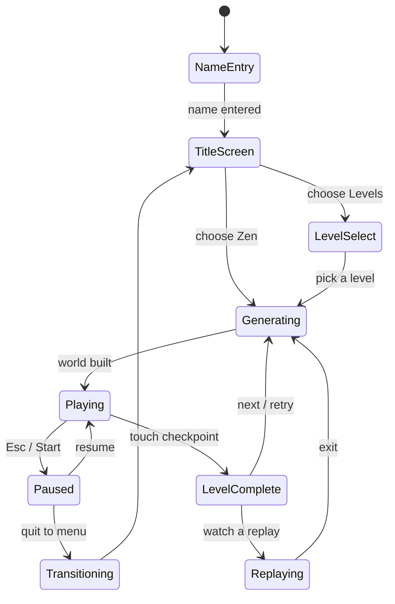
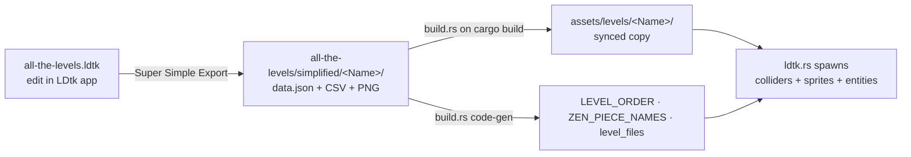

# Freefall — Architecture Guide

A map of the codebase for working on it yourself. If you own the game but didn't
write the code, **start here.** For a picture version, see the visual map
(link at the bottom).

- [The 2-minute mental model](#the-2-minute-mental-model)
- [Module map](#module-map-srcrs)
- [The game-state machine](#the-game-state-machine)
- [How the important things flow](#how-the-important-things-flow)
- [How-to recipes](#how-to-recipes)
- [Folder layout](#folder-layout)
- [Running & building](#running--building)
- [Known quirks / legacy](#known-quirks--legacy)

---

## The 2-minute mental model

The game is built on **Bevy 0.18** (a Rust game engine) with **avian2d** for
physics. Bevy is an **ECS** — Entity-Component-System. You only need five words:

| Word | What it is | In this game |
|------|-----------|--------------|
| **Entity** | an id — "a thing" | the player, a wall, a checkpoint, a UI label |
| **Component** | data stuck on an entity | `Player`, `Transform` (position), `Collider`, `Wall` |
| **System** | a function Bevy runs every frame | `player_movement`, `camera_follow`, `tick_timer` |
| **Resource** | one global piece of data | `SpeedrunTimer`, `GameMode`, the leaderboard |
| **Plugin** | a bundle of systems + resources | `PlayerPlugin`, `UiPlugin` — one per module |

**Systems run on schedules.** Two matter here:
- **`Update`** — runs once per rendered frame (varies with your framerate). Input
  reading and UI live here.
- **`FixedUpdate`** — runs at a fixed **64 Hz**, in lockstep with physics. Movement,
  the physics step, replay recording, and the timer live here so they're
  **deterministic** (same inputs → same result, regardless of framerate).

**States** (`GamePhase`) gate which systems run — e.g. movement only runs while
`Playing`. `OnEnter(State)` / `OnExit(State)` systems spawn/despawn each screen.

Everything is wired together in [`src/main.rs`](../src/main.rs): it adds each
module's plugin. That's the table of contents for the whole game.

---

## Module map (`src/*.rs`)

Each file is one feature area and has a plain-English header comment at the top.

| File | Lines | Responsibility |
|------|------:|----------------|
| [`main.rs`](../src/main.rs) | ~90 | Entry point. Builds the app, window, physics, and registers every plugin. |
| [`level.rs`](../src/level.rs) | ~440 | **Game flow.** The `GamePhase` state machine, `GameMode` (Levels/Zen), spawning/despawning the world, checkpoint completion, growing the Zen tower. |
| [`ldtk.rs`](../src/ldtk.rs) | ~650 | **Level loading.** Turns LDtk data into colliders, sprites, and entities. Holds the Zen piece-stitcher (`build_zen_world`). |
| [`player.rs`](../src/player.rs) | ~480 | **The player.** Movement, jump, dash, wall-jump, ground/wall sensing. Feel constants at the top. |
| [`ui.rs`](../src/ui.rs) | ~1750 | **Menus + HUD + timer.** Every screen, the speedrun timer, the on-screen keyboard, local best times. |
| [`net.rs`](../src/net.rs) | ~380 | **Online leaderboard** client (native only — compiled out on web). |
| [`replay.rs`](../src/replay.rs) | ~320 | **Replays.** Records inputs per fixed step; plays them back on a ghost. |
| [`pieces.rs`](../src/pieces.rs) | ~430 | *Legacy* ASCII-art Zen generator (see [Known quirks](#known-quirks--legacy)). |
| [`username.rs`](../src/username.rs) | ~270 | First-run name entry; saves the name (for leaderboard tags). |
| [`tutorial.rs`](../src/tutorial.rs) | ~225 | Tutorial prompts + tracks the last-used input device to show the right button glyph. |
| [`zen_fx.rs`](../src/zen_fx.rs) | ~220 | Zen-mode juice: height milestones, personal-best line, "NEW BEST" banner. |
| [`font.rs`](../src/font.rs) | ~57 | Applies the title/body fonts to all text globally. |
| [`sfx.rs`](../src/sfx.rs) | ~44 | Sound effects — fire a `SfxEvent`, it plays the clip. |
| [`camera.rs`](../src/camera.rs) | ~41 | Smoothly follows the player/ghost. |
| [`walls.rs`](../src/walls.rs) | ~8 | The `Wall` / `SlippyWall` marker components. |
| [`build.rs`](../build.rs) | — | **Not in `src/`** but crucial: runs *before* compile. Syncs LDtk exports into `assets/levels/` and code-generates the level registry. See [Adding content](#recipe-add-a-level). |

---

## The game-state machine

`GamePhase` (in [`level.rs`](../src/level.rs)) is the backbone. Every screen and
gameplay system is gated on one of these states.



`GameMode` (a separate resource) is just **Levels vs Zen** — it decides *which*
world `Generating` builds, but both modes share the same states.

---

## How the important things flow

### Input → movement → physics (why it feels tight)
[`player.rs`](../src/player.rs)

1. `buffer_input` runs in **`Update`**: reads keyboard + gamepad, writes to the
   `BufferedInput` resource. (One-shot presses like jump/dash *accumulate* so a
   press between physics steps is never dropped.)
2. `player_movement` runs in **`FixedUpdate`** (64 Hz): consumes `BufferedInput`,
   applies velocity/dash/jump, and records the frame for replays.
3. avian2d steps the physics at the same 64 Hz. Rendering interpolates between
   steps, so it looks smooth at any framerate.

**Controls** (keyboard / gamepad): Move `WASD` or arrows / left stick · Jump
`Space` / South (A/✕) · Dash `Left Shift` / LT · Walk `Left Ctrl` / RT · Pause
`Esc` / Start.

### The level pipeline (LDtk → game)
This is the single most important thing to understand for adding content.



`build.rs` runs automatically on every `cargo build`. It (a) copies changed
level files into `assets/levels/`, and (b) generates a registry that
[`ldtk.rs`](../src/ldtk.rs) `include!`s. **You never edit the level list by
hand** — folder names drive everything (see the recipe below).

### Replays & the timer
- **Timer** ([`ui.rs`](../src/ui.rs), `SpeedrunTimer`): ticks in `FixedUpdate` so
  it counts deterministic sim-time. Captured at the checkpoint; the corner HUD is
  frozen to that exact value so it always matches the completion menu.
- **Replays** ([`replay.rs`](../src/replay.rs)): a run is just its seed + one
  input per fixed step. Playback re-runs the same physics on a "ghost", so it
  reproduces the run exactly. The online leaderboard stores these.

### Leaderboards
- **Local** best times live in `ui.rs` (and persist to `~/.freefall/`).
- **Online** goes through [`net.rs`](../src/net.rs) → the Cloudflare Worker in
  [`worker/`](../worker/). **Native only** — the web build has no online
  leaderboard (the whole module is `#[cfg]`'d out on wasm).

---

## How-to recipes

### Recipe: add a level
1. In the **LDtk app**, open `all-the-levels.ldtk`, make a new level named
   `Level_8` (the `Level_N` name is what matters).
2. Draw on the IntGrid layers: **Walls**, **Door** (opens with a Key), **Slippy**
   (wall-slide but no wall-jump). Place a **PlayerSpawn** and at least one
   **Checkpoint** entity.
3. Export (LDtk's *Super Simple Export* — already configured to write into
   `all-the-levels/simplified/`).
4. `cargo run`. `build.rs` syncs it and auto-registers it into the level-select
   menu. **No code changes.**

### Recipe: add a Zen piece
Same as above, but the **folder name encodes how it stitches**:
`Zen_<whatever>_<entrances>E<exits>X`, where each side is `L`, `R`, or `LR`.
- `Zen_Platforms_LERX` → enters on the **L**eft, exits on the **R**ight.
- `Zen_Towers_LRELRX` → open on both sides top and bottom.
- Add a trailing suffix for variants: `Zen_Platforms_RERX2`.
The Zen generator picks compatible pieces at random and stacks them. Pieces can
be different heights. (`Zen_bottom` is the fixed starting piece.)

### Recipe: add a wall-writing or tutorial prompt
Both are LDtk **entities** you drop into a level ([`ldtk.rs`](../src/ldtk.rs) +
[`tutorial.rs`](../src/tutorial.rs)):
- **WallWriting** — decorative art on the wall. Set its `WritingID` enum (e.g.
  `Jump`); the game shows `assets/writing/<id>.png` (lower-cased). Add a new one
  by adding an enum value + dropping the PNG. No code.
- **TutorialText** — shows text near the bottom of the screen on touch. Set its
  `TutorialTextType` enum; underscores become spaces, and any `X…X` token (e.g.
  `Press_XJUMPX_To_Jump`) is swapped for the button glyph of the last-used device
  (SPACE/A/✕). New button tokens: add an arm to `action_glyph` in `tutorial.rs`.

### Recipe: tune game feel
All the knobs are **named constants at the top of
[`player.rs`](../src/player.rs)** — edit and `cargo run`:

| Constant | Controls |
|----------|----------|
| `WALK_SPEED` / `SPRINT_MULTIPLIER` | ground run speed (sprint is the default; Walk slows you) |
| `JUMP_VELOCITY` | jump height |
| `DASH_SPEED` / `DASH_DURATION` | dash strength & length |
| `WALL_JUMP_H` / `WALL_JUMP_V` / `WALL_SLIDE_SPEED` | wall-jump kick & slide |
| `COYOTE_TIME` / `WALL_COYOTE_TIME` / `JUMP_BUFFER` | forgiveness windows |
| `ACCEL` / `DECEL` / `AIR_ACCEL` / `AIR_DECEL` | how snappy grounded vs airborne movement is |

Gravity is set once in [`main.rs`](../src/main.rs) (`Gravity(Vec2::NEG_Y * 600.0)`).

### Recipe: change a keybinding
Edit `buffer_input` in [`player.rs`](../src/player.rs) — it's one block mapping
`KeyCode`/`GamepadButton` to actions. If you change dash/jump, also update the
glyphs in `tutorial.rs` (`action_glyph`) and the docs table above.

### Recipe: change a menu / add a screen
Menus live in [`ui.rs`](../src/ui.rs). Each screen follows the same pattern:
- a `spawn_*` system on `OnEnter(GamePhase::X)` builds the UI nodes,
- a `*_input` system (run only in state `X`) handles navigation,
- a `despawn_marked::<XUi>` on `OnExit` tears it down.

To tweak an existing screen, find its `fn spawn_*`. To add a screen, add a
`GamePhase` variant in [`level.rs`](../src/level.rs), then follow the same trio.

### Recipe: change the game flow
The states and their transitions are in [`level.rs`](../src/level.rs). Systems
call `next_state.set(GamePhase::…)` to move between screens — grep for
`next_state.set` to see every transition.

### Recipe: rebuild for itch.io
- Web: `.\scripts\build-web.ps1` → `dist/freefall-web.zip`
- Windows: `.\scripts\build-native.ps1` → `dist/freefall-windows.zip`

---

## Folder layout

```
freefall/
├── src/                  game code (see module map)
├── build.rs              pre-compile: sync LDtk + generate level registry
├── assets/               everything the game loads at runtime
│   ├── levels/           synced level data (build.rs writes this — don't hand-edit)
│   ├── fonts/  writing/  *.mp3  *.png
├── all-the-levels.ldtk   the LDtk project you edit
├── all-the-levels/       LDtk's "simplified" export (source of truth for levels)
├── art/                  source art — sources/ (.aseprite), tilesets/, exports/
├── web/                  index.html shell for the wasm build
├── scripts/              build-web.ps1, build-native.ps1
├── worker/               Cloudflare Worker for the online leaderboard
├── archive/              old/stray files kept for reference
└── DOCS/                 this guide
```

## Running & building
- **Play (dev):** `cargo run` — loads assets from disk, so edited level art shows
  up on the next run.
- **Release build:** `cargo build --release --features embed` — single exe with
  assets baked in.
- **Web:** `.\scripts\build-web.ps1` (needs the `wasm32-unknown-unknown` target
  and `wasm-bindgen-cli`).

## Known quirks / legacy
- **Two Zen generators.** Live Zen uses the LDtk stitcher
  (`ldtk::build_zen_world`). Zen *replays* still call the old ASCII generator
  (`pieces.rs` via `level::build_level`), so a Zen replay won't match the live
  run. Legacy; unify when replays matter for Zen.
- **Web has no online leaderboard** and doesn't persist your name / best heights
  (the disk writes no-op in the browser).
- **Edited level *art* on the web/embed build lags one build** — `build.rs` syncs
  PNGs, but they're embedded before that runs, so re-build once. (In plain
  `cargo run`, assets are read from disk, so this doesn't apply.)

---

*Visual map:* an at-a-glance diagram of all this —
<https://claude.ai/code/artifact/88f8a8e0-b087-46bf-a156-d2809cb26bbe>
(modules, the state machine, the input/physics loop, and the level pipeline).
